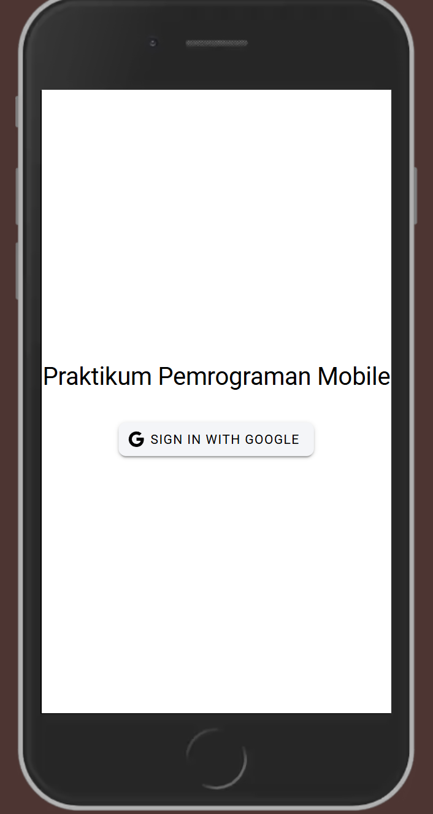
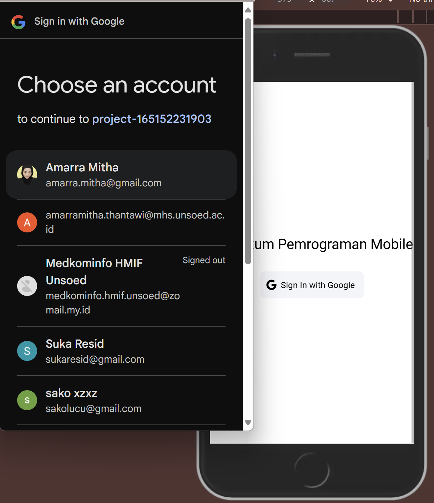
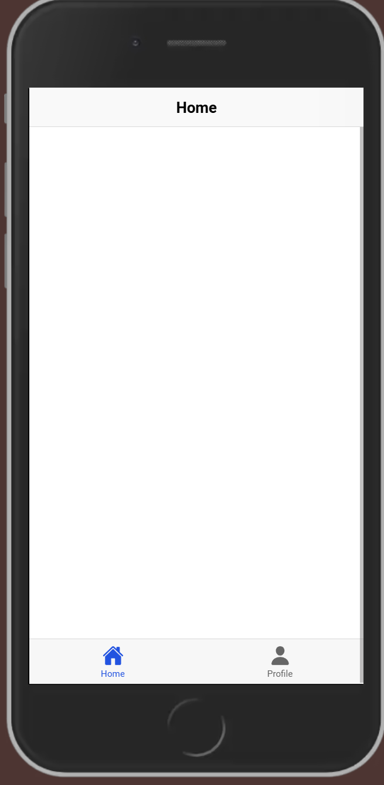
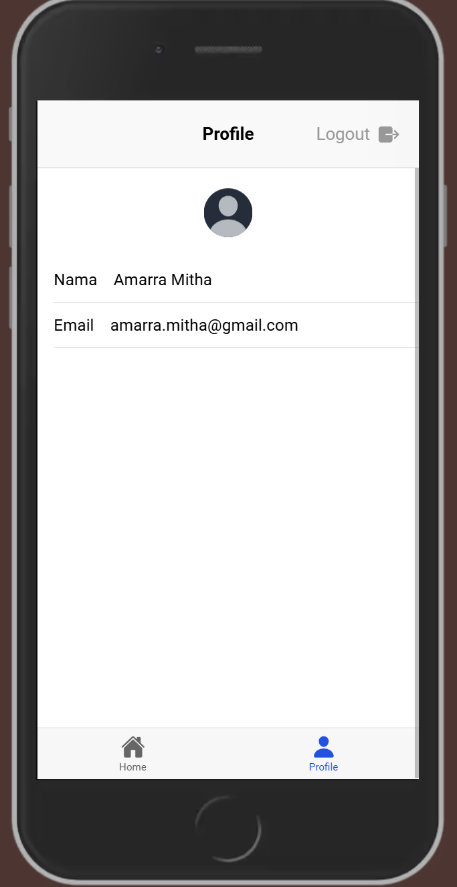
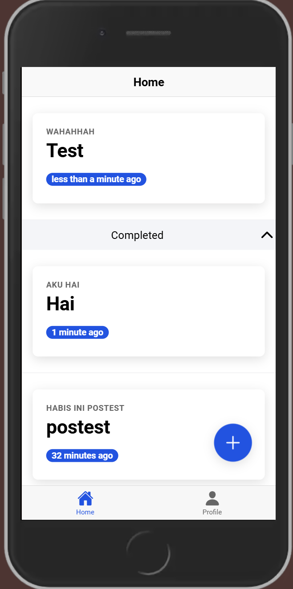
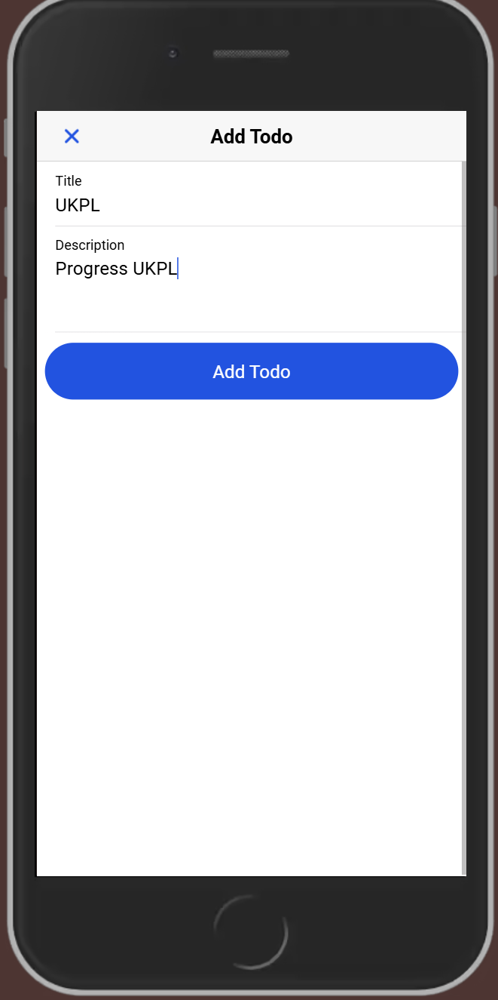
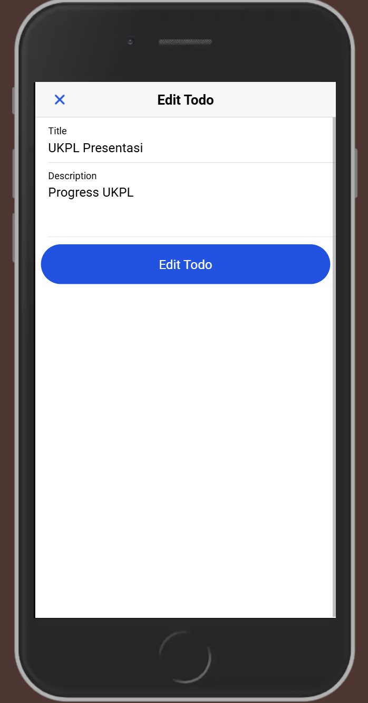
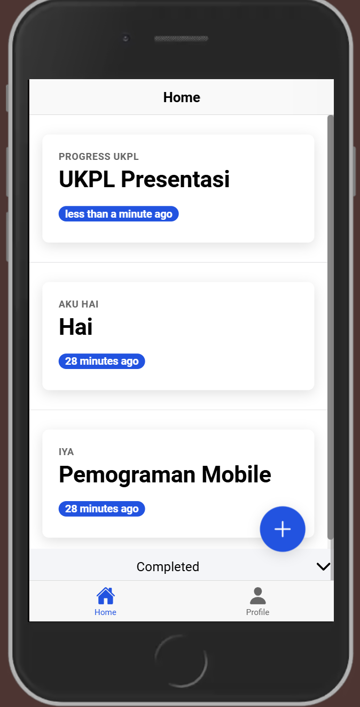
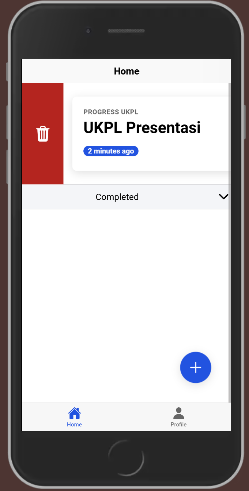

Nama : Amarramitha

NIM : H1D022064

1. **Proses Login**

- Saat pengguna mengklik tombol "Sign In with Google", fungsi loginWithGoogle dipanggil.
- Aplikasi menggunakan isPlatform('capacitor') untuk mendeteksi apakah aplikasi berjalan di platform mobile (iOS/Android) atau web.

2. **Proses Login dengan Google**

- Aplikasi membuat instance GoogleAuthProvider untuk otentikasi Google di Firebase.
- Dengan signInWithPopup, Firebase memunculkan popup Google login, di mana pengguna dapat login menggunakan akun Google mereka.
- Jika berhasil, Firebase mengembalikan objek result yang berisi data pengguna yang berhasil login.
- Setelah proses login berhasil (baik pada platform web atau mobile), result.user berisi informasi akun Google pengguna yang sedang login, seperti displayName (nama pengguna), email, photoURL (foto profil), dan lainnya.
- Data pengguna ini disimpan dalam variabel user, yang merupakan ref dengan tipe User dari Firebase, sehingga dapat diakses di seluruh aplikasi melalui store auth.

3. **Navigasi ke Halaman Utama**

- Setelah login berhasil, aplikasi akan melakukan navigasi ke halaman utama (/home) menggunakan router.push("/home");.

4. **Mengakses Nama Pengguna dan Profil**

- Setelah pengguna berhasil login, data pengguna dari akun Google disimpan dalam objek user.
- Objek ini berisi informasi akun, seperti displayName (nama pengguna) dan photoURL (URL foto profil), yang dapat diakses melalui user.value.displayName dan user.value.photoURL.
- Aplikasi dapat menggunakan informasi ini untuk menampilkan nama pengguna dan foto profil di berbagai halaman atau komponen.

5. **Logout**

Fungsi logout memungkinkan pengguna untuk keluar dari akun mereka. Ini menggunakan Firebase signOut untuk menghapus status autentikasi di Firebase. Di platform mobile (iOS/Android), GoogleAuth.signOut() juga dipanggil untuk membersihkan sesi Google. Setelah berhasil logout, aplikasi mengatur user menjadi null dan mengarahkan pengguna kembali ke halaman login (/login).

6. **Menjaga Status Autentikasi dengan onAuthStateChanged**

Dengan menggunakan onAuthStateChanged, aplikasi akan mendeteksi perubahan status autentikasi pengguna. Setiap kali status autentikasi Firebase berubah (misalnya, pengguna login atau logout), nilai user akan diperbarui. Hal ini memungkinkan aplikasi untuk menampilkan atau menyembunyikan konten berdasarkan status login pengguna.

7. **Proses Create**

Ketika tombol **Tambah** pada **Floating Action Button (FAB)** ditekan, modal input (**InputModal**) akan terbuka. Di dalam modal ini, pengguna dapat memasukkan data *todo*. Data yang diisi secara langsung terhubung dengan properti bind `v-model`, sehingga nilai input diperbarui secara real-time. Ketika pengguna menekan tombol **Simpan**, event `@submit` akan dipicu, yang kemudian memanggil fungsi `handleSubmit(todo)` untuk memproses data.

Pada fungsi `handleSubmit(todo)`, langkah pertama adalah validasi input. Jika *title* kosong, maka fungsi akan menampilkan pesan peringatan melalui `showToast`. Jika validasi lolos, fungsi akan memeriksa apakah `editingId` kosong. Jika kosong, artinya pengguna menambahkan data baru, dan fungsi `firestoreService.addTodo(todo)` dipanggil untuk menyimpan data *todo* baru ke database. Setelah data berhasil disimpan, fungsi `loadTodos()` akan dijalankan untuk memperbarui daftar *todo*, dan notifikasi keberhasilan akan muncul menggunakan `showToast`. Proses ini memastikan alur tambah atau simpan data *todo* berjalan lancar dari awal hingga akhir.

8. **Proses Edit**

Ketika pengguna ingin mengedit data, mereka dapat memilih item *todo* yang ada, yang kemudian akan membuka modal input (**InputModal**) dengan data yang telah terisi. Data *todo* yang dipilih akan dihubungkan ke modal melalui `v-model`, memungkinkan pengguna melihat dan mengubah data langsung di dalam modal.

Ketika pengguna selesai melakukan perubahan dan menekan tombol **Simpan**, event `@submit` akan memanggil fungsi `handleSubmit(todo)` untuk memproses data yang telah diperbarui. Dalam fungsi ini, sistem memeriksa apakah `editingId` memiliki nilai. Jika iya, artinya pengguna sedang mengedit data yang ada. Dalam kasus ini, fungsi `firestoreService.updateTodo(editingId, todo)` akan dipanggil untuk memperbarui data pada database berdasarkan ID *todo* yang sedang diedit.

Setelah pembaruan berhasil, fungsi `loadTodos()` dipanggil untuk memperbarui daftar *todo* sehingga mencerminkan perubahan yang baru saja dilakukan. Terakhir, sistem menampilkan notifikasi keberhasilan dengan menggunakan `showToast`, memberi tahu pengguna bahwa data telah berhasil diperbarui. Alur ini memastikan proses pengeditan berjalan dengan mulus dan perubahan tersimpan dengan baik.

9. **Proses Delete**

Proses penghapusan *todo* dimulai dengan memilih item yang ingin dihapus, kemudian pengguna menekan tombol **Delete** yang tersedia. Setelah itu, aplikasi akan meminta konfirmasi dari pengguna untuk memastikan penghapusan, misalnya melalui modal atau notifikasi. Jika dikonfirmasi, fungsi `deleteTodo(todoId)` dipanggil untuk menghapus item dari *database* (misalnya Firestore). Setelah penghapusan berhasil, aplikasi memuat ulang daftar *todo* dengan fungsi `loadTodos()` dan menampilkan notifikasi keberhasilan, sehingga tampilan UI diperbarui dan item yang dihapus tidak lagi muncul.